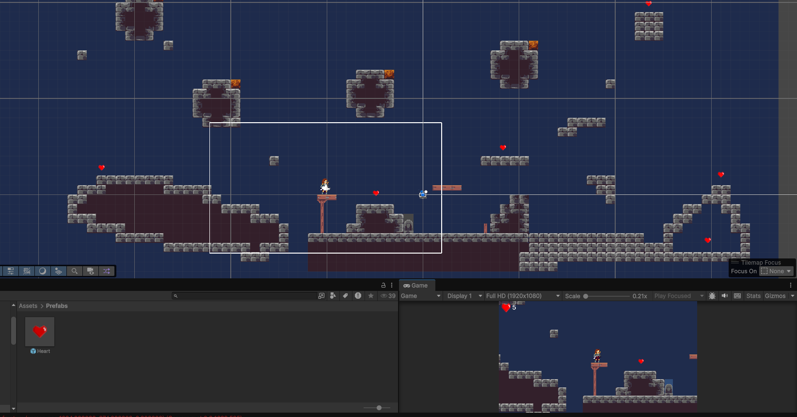
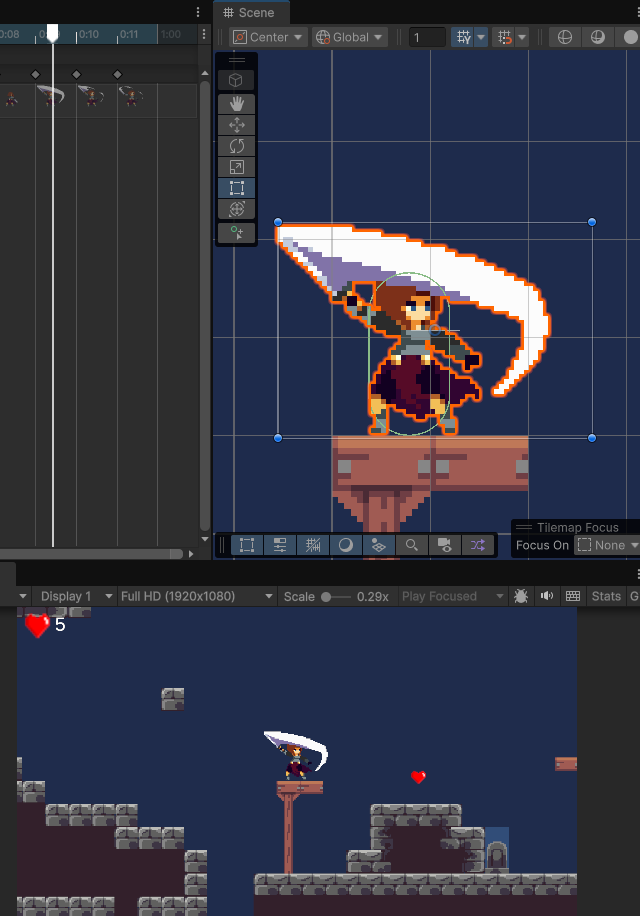

# 🏰 Medieval Platformer

Um jogo de plataforma 2D com temática medieval desenvolvido na Unity.

O jogador deverá explorar o cenário, enfrentar inimigos e coletar recompensas ao longo da jornada, superando desafios para avançar pelas fases.

## 🎮 Funcionalidades

- Movimentação do personagem
- Sistema de pulo
- Combate contra inimigos
- Coleta de recompensas
- Ambiente medieval em 2D

## 🛠️ Tecnologias Utilizadas

- Unity
- C#
- Git
- GitHub

## 🚧 Status do Projeto

O projeto está em desenvolvimento e novas funcionalidades serão adicionadas futuramente.

### Planejado para próximas versões

- Novos inimigos
- Sistema de vidas
- Mais fases
- Efeitos sonoros
- Interface de usuário (HUD)
- Sistema de pontuação

## 📷 Capturas de Tela
# tela cheia

  

# ⚔️ Sistema de Combate

  

## 👨‍💻 Autor

Bruno Rodrigues  

## 🏛️ Instituição

Universidade Federal do Pará (UFPA)

## 🤝 Apoio

Projeto desenvolvido com apoio do Laboratório de Pesquisa Operacional (LPO/UFPA).

Site do LPO: https://lpo.ufpa.br
## Créditos

Este projeto foi desenvolvido acompanhando as aulas do canal Over Games.

Parte do código, sprites e demais assets utilizados foram obtidos a partir do material disponibilizado pelo autor para fins educacionais.

Este repositório tem finalidade de estudo e aprendizado em desenvolvimento de jogos com Unity.
